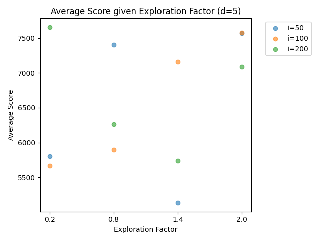
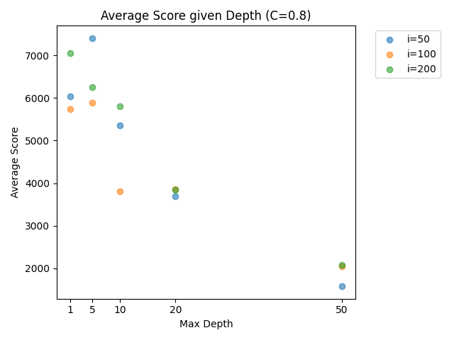
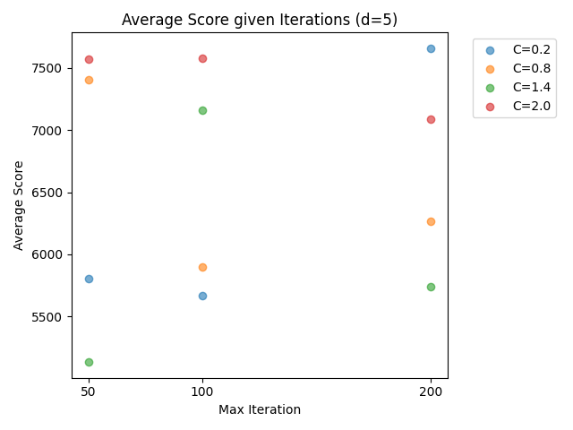
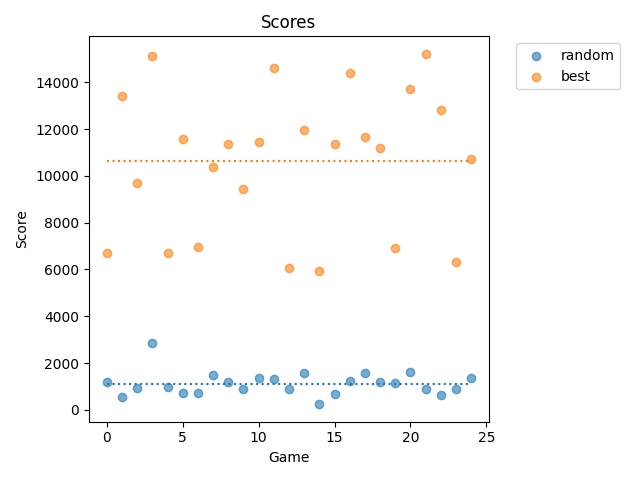

# Blog Post

## Problem Statement (Max)

For our project, we built a 2048 PyGame implementation and then created an agent
that built a Monte Carlo Search Tree to try to optimize movement. In order to
make it more difficult for our agent, we also added an adversary that selects
randomly from the worst possible new tile placements. We were motivated because
this project had a simple game implementation, which actually creates a large
amount of complexity in encoding our value statements into an agent. It also
represented an optimization problem since the agent requires us to search a
large number of game states in order to find an accurate upper confidence bound
for action value.

### Running our Project

Our project can be run from the command line with via the `main.py` file. We
tracked project dependencies with uv, and recommend running `uv sync` to install
all used libraries from the `pyproject.toml` file. To get more info on the
command, run the command with the `--help` flag.

```
uv run main.py --help
uv run main.py run --help
uv run main.py test --help
```

Sample command for running with graphics is `uv run main.py -i 200 -d 5 run` and
to run without graphics 5 times use, `uv run main.py -i 200 -d 5 test -r 5`.

To see if you can beat the AI yourself run `uv run main.py run -p` (don't try
too hard though!).

### Software / Hardware Requirements

All software requirements are included in the `pyproject.toml` file. Our project
uses `uv`, but any Python interpreter >= 3.14 should work fine. If your hardware
is struggling to run the project (mine does with ~800 iterations and ~10 depth),
then try reducing the number of iterations or depth. Unfortunately, optimizing
the game in python was a key challenge for this project.

## Related Solutions (Han)

### Existing Solution Methods

#### [Minimax Search](https://aj-r.github.io/2048-AI/) ([repo](https://github.com/aj-r/2048-AI))

- A minimax-like lookahead (depth 3) algorithm with an evaluation function. On
  each turn, it scores the current board, simulates each possible move, then
  recursively plans ahead three moves deep to estimate how good the resulting
  board states are.
  - The evaluation function favors boards with rows and columns whose values
    consistently increase/decrease, on top of rewarding having more empty cells,
    as having more empty cells leaves more room for moving tiles around,
    preserving future mobility and merge opportunities.
- The repo also includes an "Algorithm-based" solution, which mimics a naive
  human heuristic for 2048
  - Follow the movement pattern: Up -> Left -> Up -> Left (etc). It is
    effectively a fixed moving routine. If the intended move is illegal, it
    falls back to a fixed backup ordering of Up -> Left -> Right -> Down until
    it finds a legal move.
    - Generally speaking, it preserves patterns and keeps the "highest value"
      square in the corner.
- Includes an "Evil" tile generator, which acts as a minimizing agent
  - Upon selection, the tiles generated will try to be done in such a way that
    actively harms the position (least merge-able spot) of the player.

#### [Backward Temporal Coherence Learning with Expectimax](https://ziap.github.io/2048-ai/) ([repo](https://github.com/ziap/2048-tdl))

- Backward Temporal Coherence Learning:
  - A form of reinforcement learning technique that updates action values by
    looking backward from a final reward to previous states to strengthen the
    connection between moves and outcomes.
  - While our implementation uses MCTS, which rollouts simulate _forward_ from
    the current state to a terminal node to estimate value, BTCL updates values
    by propagating information from future states _back_ to past states using a
    weighted average TD-errors based on future, known outcomes, which speeds up
    convergence.
- N-Tuple Network:
  - The evaluation function the agent uses to score board states. Instead of
    using a deep neural network (DNN), it uses a collection of fixed board-cell
    patterns (tuples). Each tuple looks at small groups of tiles in the 2048
    board. For each possible tile combination in that pattern, the network
    stores a learned weight. The board is then evaluated by looking up the
    weights for all matching tuple patterns and adds them together to produce
    one score for the board.
    - When run in **1 ply** mode, the agent applies each possible move,
      evaluates the resulting board using the trained N-Tuple Network, and
      chooses the move with the best learned value.
    - But when run in **3 ply** mode, it adds a shallow Expectimax search on top
      of the learned evaluator, meaning it looks ahead through player moves and
      random tile spawns and then uses the trained network to evaluate the leaf
      states. Expectimax helps select the move with the highest expected value.

#### [Markov Decision Process (MDPs)](https://jdlm.info/articles/2018/03/18/markov-decision-process-2048)

- The article explains how 2048 can be modeled as a Markov Decision Process,
  where each board configuration is a state, each swipe direction is an action,
  and the uncertainty comes from the random spawning of new 2 or 4 tiles.
  - This framework is used to define transition probabilities, rewards, values,
    and policies, then solves for optimal policies on smaller versions of 2048.
  - The reward is defined around reaching a target tile, so the optimal policy
    is the strategy that maximizes the probability of eventually reaching that
    target
- Lots of notes on Markov chains and probabilities of entering different states
  based on player/adversary goals. It enumerates the options and probabilities
  for entering each state and its successors, and also details options for
  these:
  - Many successor states are rotations or reflections of each other

> "The player’s objective is to reach the win state. We do this by defining
> rewards. In general, each time an MDP enters a state, the player receives a
> reward that depends on the state. Here we’ll set the reward for entering the
> win state to 1, and the reward for entering all other states to 0. That is,
> the one and only way to earn a reward is to reach the win state."

- The main takeaway is that exact optimal play is possible only for reduced
  versions of the game because the full 4x4 2048 state space is enormous.
  - Solving full 2048 exactly is likely infeasible with full enumeration, so
    approximate reinforcement-learning methods are more practical for the
    complete game.
- **We did not consider MDPs in our project.**

## State Space, Actions, Transitions, and Observations (Max)

### State Space

The state space is very large. Tiles can have values from $2^1$ to $2^{17}$, or
131,072. These tiles can appear almost anywhere on the board, and each tile can
have almost any value from the range above. This means that a state space search
was impractical. The total number of possible options up to a 2048 tile are
(according to this
[blog post](https://jdlm.info/articles/2017/12/10/counting-states-enumeration-2048.html)
by the cofounder of overleaf) 44,096,167,159,459,777 or ~44 quadrillion with a
combinatorics bound and more like >> 1.3 trillion with an incomplete exhaustive
search in reality with proper gameplay constraints.

However, we can represent the state space simply. In our implementation, it is a
list of lists for the board and a tile class for the tiles on the board. This
again relates back to our motivation. While seemingly simple in representation
and implementation details, the underlying exponential function explodes the
complexity underneath the hood after playing out many moves.

### Actions

The actions are quite simple. The agent is picking from up, down, left , or
right. However, things get more complicated when we transition to a new state
since the tile placed is random. This means that despite picking an action, we
also relied on a random factor in the adversary to place a new tile. No move was
fully deterministic, and so the agent had to simply average the score for all
random events given an action to predict the outcome of the state transition.

### Observations

Our project was fully observed, so this wasn’t a factor at all.

## Solution Method (YG)

The adversary provides a top "k" number of tile placements to randomly choose
between. Technically, the most optimal method for succeeding in 2048 is to keep
larger tiles in one of the four corners of the board and "merge" other tiles
towards a cluster close by the largest tile. We implemented Monte Carlo to see
multiple depth levels and iterations that would theoretically maximize the game
score for the agent, taking into account the adversary’s bias for "worse"
placements for tiles. While our implementation was not perfect, the agent
generally selects moves that keep higher tiles and clusters together towards a
corner and merges the same value tiles. Sometimes, the agent does not merge the
same value tiles if it foresees an action where the tiles can be merged later
on, multiple times.

## Implementation (Mack)

Our implementation of the state representation evolved greatly over the course
of the project. We started by representing the board as a 2D array using the
built-in `list` type. However, these states must be immutable to be used in our
Monte Carlo Search Tree. As such, any mutations to the state require first
duplicating the state in memory. This was an issue, as new states are created
all the time (upwards of thousands of times per move), and we were running into
performance bottlenecks. To fix this issue, we updated our gamestate to use
Numpy's `ndarray` type. This made copies more efficient and greatly improved
performance. We also made optimizations to reduce the number of copies made per
turn.

We encoded the Monte Carlo Search Tree as a set of Q and N tables, represented
as `dicts` (hence why `GameState`s must be immutable). This "tree" is then used
by the `Agent` to pick the most optimal next move.

We also implemented a testing harness to collect data from a number of runs at
once. This is what we used to collect the data discussed below.

## Results (Mack)

Tuning the model was one of the most difficult parts of this project. Changing
parameters often led to unexpected drops in score or runtime performance (and
often both).

By making the game more complex and adding an adversary that places tiles
maliciously, it is possible that we made the game a bit too hard. If we had more
time, we would have also liked to tweak our state evalutaion function and
rollout policy to optimize for score. All of these aspects have the potential
for improvement in future iterations of this project.

The data from a number of our tests can be found in the `data` directory in the
repo. From this, we created a few visual representations. Behold the graphs
below:









_The "best" model was run with the parameters `max_depth` = 1 `max_iter` = 400,
and `exploration_factor` = 1.4._

For all graphs the following parameters are constant:

- `num_runs` = 10
- `board_size` = 4
- `adversary_k` = 10
- `agent_mode` = "mc"

While the following vary:

- `max_depth`
- `max_iter`
- `exploration_factor`

The data produces more questions than answers. The most obvious is why does
model performance seem to degrade as the depth is increased? This seems
contradictory, as a higher depth should give the algorithm more information, yet
it instead leads the agent to death more quickly. This may be related to how we
simulate rollout or how we score future states.

Overall, though, the model performs well. It consistently does better than just
taking random moves, and continues to improve with small tweaks to the
parameters.
